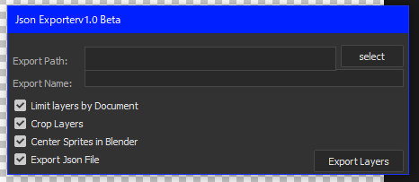
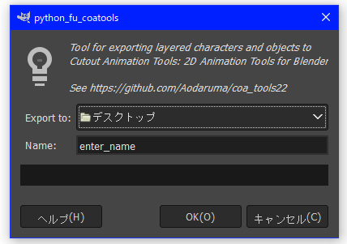
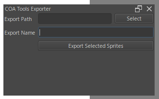

<!--  -->

# COA tools 2

the Addon of Cutout Animation Tools for Blender, which allows you to create cutout animations in Blender.

[](https://github.com/Aodaruma/coa_tools2/releases)

## Table of Contents

- [Description](#description)
- [Download and Installation](#download-and-installation)
  - [Photoshop Exporter](#photoshop-exporter)
  - [GIMP Exporter](#gimp-exporter)
  - [Blender Addon](#blender-addon)
- [Development](#development)

## Description

COA Tools 2 is an add-on developed by [ndee89](https://github.com/ndee85) and modified/remade by Aodaruma, which enables 2D rigging and animation within Blender.

[The original COA Tools by ndee89](https://github.com/ndee85/coa_tools) provided a rapid workflow for creating 2D cutout characters/animations in Blender. With COA Tools 2, the goal is to support Blender 3.4 and above, introduce automatic mesh generation, and establish a workflow with minimal features, allowing direct editing without going through proprietary modes.

Currently, the focus for development is on two aspects:

1. Photoshop sprite exporter
2. Blender add-on

The intention is to concentrate on these areas, specifically addressing the necessary improvements.

Since development is a time and resource-intensive process, it's not easy to being solely undertaken by me. However, if there are multiple developers willing to contribute and if the project necessitates scalability, I am considering inviting collaborators to join :)

## Download and Installation

### Download

You can download coa_tools2 from these sources:

1. [releases page](https://github.com/Aodaruma/coa_tools2/releases) (stable)
2. [master branch zip](https://github.com/Aodaruma/coa_tools2/archive/refs/heads/master.zip) (unstable)
3. [develop branch zip](https://github.com/Aodaruma/coa_tools2/archive/refs/heads/develop.zip) (very unstable; new feature included)

### Installation

#### Photoshop Exporter



1. Download exporter from [releases page](https://github.com/Aodaruma/coa_tools2/releases) or [master branch zip](https://github.com/Aodaruma/coa_tools2/archive/refs/heads/master.zip) and unzip it.
2. Copy `Photoshop/BlenderExporter.jsx` to the Photoshop scripts folder.
    - Windows: `C:\Program Files\Adobe\Adobe Photoshop CC 20XX\Presets\Scripts`
    - MacOS: `/Applications/Adobe Photoshop CC 20XX/Presets/Scripts`
3. Open Photoshop and psd file you want to export.
4. Run the script from `File -> Scripts -> BlenderExporter.jsx` to export sprites

#### GIMP Exporter



Referenced from [here](https://docs.gimp.org/en/install-script-fu.html)

1. Download exporter from [releases page](https://github.com/Aodaruma/coa_tools2/releases) or [master branch zip](https://github.com/Aodaruma/coa_tools2/archive/refs/heads/master.zip) and unzip it.
2. Open GIMP and go to `Edit -> Preferences -> Folders -> Plugins` to find the plugin folder.
3. Copy `GIMP/coatools_exporter.py` to the GIMP plugin folder.
4. Restart GIMP.
5. Open GIMP and xcf file you want to export.
6. Run the script from `File -> Export to CoaTools...` to export sprites

#### Blender Addon

1. Download exporter from [releases page](https://github.com/Aodaruma/coa_tools2/releases) or [master branch zip](https://github.com/Aodaruma/coa_tools2/archive/refs/heads/master.zip) and unzip it.
    - if you downloaded from master branch, zip `/coa_tools2` folder after unzip master branch zip.
2. Open Blender and go to `Edit -> Preferences -> Add-ons -> Install...`
3. Select `coa_tools2.zip` and click `Install Add-on from File...` to install.
4. Enable `COA Tools 2` add-on.
5. Once the add-on is activated, go to `View -> Sidebar -> COA Tools 2` to open the COA Tools 2 panel.

#### Krita PLugin



Referenced from [here](https://docs.krita.org/en/user_manual/python_scripting/install_custom_python_plugin.html)

1. Download plugins from [releases page](https://github.com/Aodaruma/coa_tools2/releases) or [master branch zip](https://github.com/Aodaruma/coa_tools2/archive/refs/heads/master.zip) and unzip it.
2. Copy all content from the `/Krita` directory into these directories:
    - Windows: `%APPDATA%\krita\pykrita`
    - Linux: `$HOME/.local/share/krita/pykrita`
    - MacOS: `$HOME/Library/Application Support/krita/pykrita`
3. Open Krita.
4. Go to `Settings` -> `Configure Krita`.
5. Access the `Python Plugin Manager`.
6. Enable the `COA Tools Exporter` plugin.
7. Once the plugin is activated, go to `Settings` -> `Dockers`.
8. Enable the `COA Tools Exporter` docker.

To use the plugin select all the layers that should be exported, select export path, export name and press
Export Selected Sprites button.

## Development

The source code for development is in the main branch. `coa_tools2` folder is a main body of the add-on. For efficient development, you can create a link to that folder in the Blender `addons` folder.

``` bash
# Linux
LATEST_BLENDER_DIR=$(find "$HOME/.config/blender" -d 1 | grep -e "[0-9]\.[0-9]" | sort -rh | head -n 1)
ln -s "$PWD/coa_tools2" "$LATEST_BLENDER_DIR/scripts/addons/coa_tools2"
```

``` bash
# macOS
LATEST_BLENDER_DIR=$(find "$HOME/Library/Application Support/Blender" -d 1 | grep -e "[0-9]\.[0-9]" | sort -rh | head -n 1)
ln -s "$PWD/coa_tools2" "$LATEST_BLENDER_DIR/scripts/addons/coa_tools2"
```

```powershell
# Windows PowerShell
$LatestBlenderDir = (Get-ChildItem "$env:APPDATA\Blender Foundation\Blender" -Directory | Where-Object { $_.Name -match "[0-9]\.[0-9]" } | Sort-Object -Descending | Select-Object -First 1).FullName
New-Item -ItemType Junction -Path "$LatestBlenderDir\scripts\addons\coa_tools2" -Value "$(Get-Location)\coa_tools2"
```

I'm using pipenv for dependency management. You can install the dependencies with `pipenv sync` if you have already installed pipenv.

Some extensions of vscode are recommended for development and written in `.vscode/extensions.json`. Feel free to use them.
